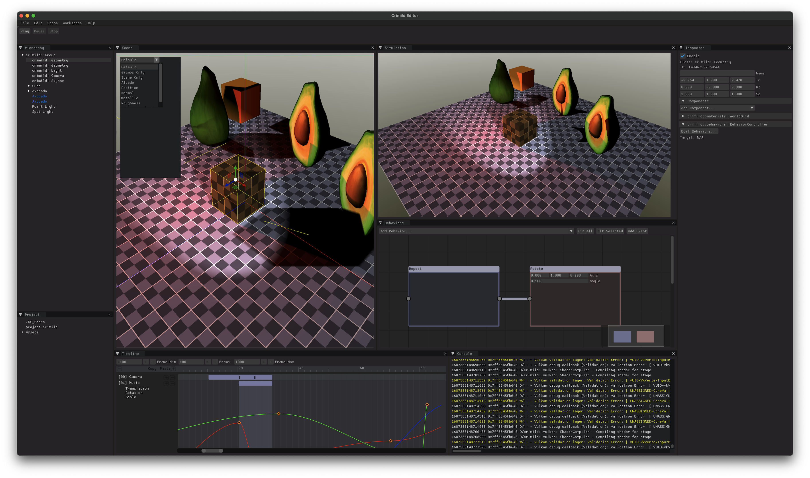

# Crimild
A scene graph based framework for interactive 3D applications




## Development Diaries
Check out Crimild's blog at http://crimild.hhsaez.com

## Table of Contents
+ [Cloning](#Cloning)
+ [Building](#Building)
+ [Examples](#Examples)
+ [Contributing](#Contributing)
+ [License](#License)

## <a name="Cloning">Cloning</a>
```
git clone --recursive https://github.com/hhsaez/crimild.git
```

### Updating existing code
```
git pull origin <BRANCH_NAME>
git submodule update --init --recursive
cmake .
```

## <a name="Building">Building</a>

### Unix Makefiles
```
cmake . -Bbuild
cmake --build build -- -j8
```

### OSX

**Note:** In order for the Vulkan shader compiler to work correctly, make sure there is no `glslang` directory in VULKAN_SDK/macOS/include
That way, the compiler uses the header files that are in `third-party` instead.

```
cmake . -G Xcode
```

### MSYS
```
cmake . -G "MSYS Makefiles" -i
```

### Windows

Requirements
* CMake
* Visual Studio 2019 or above

```
cmake . -G "Visual Studio 16 2019" -A x64 -S . -Bbuild
cmake --build build --config Release --target Triangle
```

### Web (Wasm/WebGL)
```
mkdir build-web
cd build-web
cmake .. -DCMAKE_TOOLCHAIN_FILE=#{EMSCRIPTEN_HOME}/cmake/Modules/Platform/Emscripten.cmake
make clean all -j8
```

## Examples
See [examples](examples/README.md) for details

## Contributing
The easiest way to contribute is to submit pull requests with your changes against the master branch in GitHub.

## License
Crimild is distributed under the BSD license. See the LICENSE file for details

# Debugging

## LLDB
```
lldb -b -o run [PROGRAM_NAME]
```
