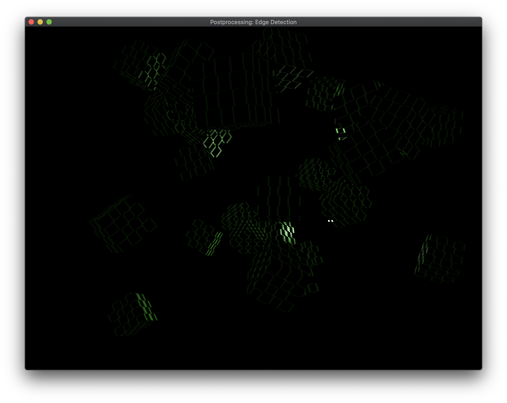

# Crimild Demos and Examples

## Table of Contents
+ [Basics](#Basics)
+ [Primitives](#Primitives)
+ [Textures](#Textures)
+ [Advanced](#Advanced)

## Basics
&nbsp; | &nbsp; | &nbsp;
-- | -- | --
|[Triangle](Triangle/) | Basic (and very explicit) example for rendering a single colored triangle using Crimild. This shows the most important concepts and tools in the engine like geometries, buffers, pipelines and render passes.
 | [Transformations](Transformations) | Creates a scene with many objects, each of them with a different transformations. Shows how to specify translations, rotations and scales using the local transformation of nodes.

## Primitives
&nbsp; | &nbsp; | &nbsp;
-- | -- | --
 | [Points](Points) |Shows how to use a POINTS primitive to build a point cloud.
 | [Lines](Lines) | Shows how to use a LINES primitive.
 | [Spheres](Spheres) | Shows how to use a Sphere primitive.
 | [Boxes](Boxes) |Shows how to use a Box primitive.
 | [Parametric Primitives](ParametricPrimitives) | Shows how to use each of the parametric primitives, using different generator params, to construct several objects objects.
<a name="Textures">Textures</a> | |
 | [Textures](Textures/) | Loads an image from disk and create an image view, a sampler and a texture to display it on screen. Shows how to use primitives with texture coordinates as well.
 | [Texture Mipmaps Generation](TextureMipmaps/) | Automatically generate mipmaps in runtime for a texture.
 | [Texture Filters](TextureFilters/) | Create textures by using different min/mag filter options in samplers.
 | [Texture Wrap Mode](TextureWrapping/) | Create textures by using different wrap modes options in samplers.
<a name="Environment">Environment</a> | |
 | [Skybox](Skybox) | Use a cubemap texture to render a skybox around a scene.
 | [Environment Mapping](EnviornmentMapping) | Implements simple reflection and refraction effects using environment mapping.
<a name="Lighting">Lighting</a> | |
 | [Lighting Unlit](LightingUnlit) | Uses an unlit material to show how colors are displayed when no lighing is available.
 | [Lighting Material](LightingMaterial) | Renders a scene with several objects using the LitMaterial class.
 | [Lighting Diffuse Map](LightingDiffuseMap) | Renders Planet Earth with diffuse texture and single point light, using Phong shading model.
 | [Lighting Directional](LightingDirectional) | Uses a single directional light to lit a scene.
 | [Lighting Point](LightingPoint) | Uses a single point light to lit a scene.
 | [Lighting Spotlight](LightingSpotlight) | Uses a single spotlight light to lit a scene
 | [Lighting Multiple](LightingMultiple) | Creates a scene with lots of cubes and adds multiple light sources: one directional light, two point lights moving around the scene and a flashlight (using a spot light). Camera can be controlled with WASD and the mouse.
 | [Normal Mapping](NormalMapping) | Uses a normal texture to provide more detail to models
<a name="Loaders">Loaders</a> | |
 | [OBJLoader](OBJLoader) | Shows how to use the OBJ loader to create a simple scene by loading models from files.
<a name="DepthStencil">Depth/Stencil</a> | |
 | [Depth](Depth) | Visualizes the depth buffer by implementing a custom shader.
 | [Depth Functions](DepthFunc) | Visualizes what happens when depth testing is disabled.
 | [Stencil Outline](StencilOutline) | Renders an outline around some objects using the stencil buffer and multiple passes
<a name="Alpha">Alpha</a> | |
 | [AlphaDiscard](AlphaDiscard) | Displays a scene with several objects, discarding fragments if the alpha value is lower than some threshold.
<a name="Pipelines">Pipelines</a> | |
 | [Pipeline Cull mode](PipelineCullMode) | Modify a pipeline to disable back-face culling for a rotating quad.
<a name="Compositions">Compositions</a> | |
 | [Postprocessing Negative](PostprocessingNegative) | Applies a "negative" post processing effect by using frame compositions
 | [Postprocessing Grayscale](PostprocessingGrayscale) |  Converts a color scene into grayscale by using frame compositions
 | [Postprocessing Sharpen](PostprocessingSharpen) | Applies a sharpen convolution to a rendered scene by using frame compositions
 | [Postprocessing Blur](PostprocessingBlur) | Applies a blur convolution to a rendered scene by using frame compositions
 | [Postprocessing Edges](PostprocessingEdges) | Process a rendered scene, highlighting edges by using frame compositions
<a name="Shadows">Shadows</a> | |
 | [Directional](Shadows) | A simple scene is rendered using a directional light that cast shadows on both dynamic and static objects.
 | [Spot](ShadowsSpot) | A simple scene is rendered using a spot light that cast shadows on both dynamic and static objects
 | [Point](ShadowsPoint) | A scene is rendered using a point light that casting shadows for all objects in all directions
 | [Directional (many lights)](ShadowsDirectionalMultiple) | A simple scene is rendered using two directional lights, each one casting shadows on both dynamic and static objects.
 | [Spot (many lights)](ShadowsSpotMultiple) | A simple scene is rendered using three spot lights with different colors, each one casting shadows on both dynamic and static objects
 | [Point (many lights)](ShadowsPointMultiple) | A scene is rendered using three point lights with different colors, each one casting shadows for all objects in all directions
<a name="Image Effects">Image Effects</a> | |
 | [HDR](HDR) | Renders a scene with HDR enabled, providing more control over  bright and dark colors
 | [Bloom](Bloom) | Filters brigth areas, applying blur to the result, to generate a light bleeding effect
<a name="Shaders">Shaders</a> | |
 | [Smiley](Smiley) | TBD
<a name="PBR">PBR</a> | |
 | [PBR Basic](PBRBasic) | TBD
 | [PBR Texture](PBRTexture) | TBD
 | [PBR Image Based Lighting](PBRIBL) | TBD
 | [PBR 3D Model](PBRModel) | TBD
<a name="Particles">Particles</a> | |
 | [Fire](ParticlesFire) | TBD
